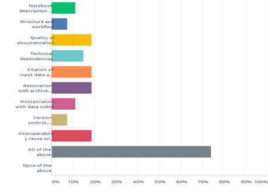

[Previous](Introduction.md) | [Table of contents](README.md) | [Next](objectives-and-needs.md)

***
# 2. BACKGROUND
In 2019 discussions emerged between the  Working Group on Information Systems and Services and Capacity Development Working Group of CEOS.  The question was asked if there was and emerging technology that could facilitate broad exploitation of EO Data across many domains and countries.  
It became evident that Jupyter Notebooks were employed across many of our systems and could provide an easy entry point for many new users, in addition to providing a record of scientific research.  They were also beginning to emerge as tools and training materials in their own right.  
In order to understand the challenges faced by the EO community and envisage how they could be supported by CEOS we conducted a survey of agencies involved in the two working groups.  We receive responses from 52 individuals and it emerged that the two primary community needs where for 

1. An awareness raising webinar for the broad EO community
1. A best practice that covered Jupyter Notebooks as tools/training materials as well as a record of research.

The survey showed the need for a broad range of topics to be covered by such a best practice

Q11: Do you you think the CEOS community would benefit from best practice advice on any of the following 

The CEOS[Working Group on Capacity Building and Data Democracy](https://ceos.org/ourwork/workinggroups/wgcapd/) and the[Working Group on Information Systems and Services](https://ceos.org/ourwork/workinggroups/wgiss/) ran a joint webinar on Jupyter Notebooks for Capacity Development on the 21st July 2021.  
The aim of this webinar was to introduce space agencies and environmental organizations worldwide to Jupyter Notebooks and take a tour of emerging services from CEOS Agencies and their applications.
We illustrated how Jupyter Notebooks can be used to support capacity development and the exploitation of Earth Observation data by a broad range of users. There were two sessions via zoom to allow for global attendance.
We also presented the preliminary topic area to 536 registrants of the Webinar and conducted an in depth follow up survey. Over 94% of respondents endorsed the need for a best practice covering the identified topic areas.

We then held 2 dedicates workshops on the 21st October 2022 and 26th October 2023 to develop the technical content in section 4 [add additional info after final workshop]

***
[Previous](Introduction.md) | [Table of contents](README.md) | [Next](objectives-and-needs.md)
